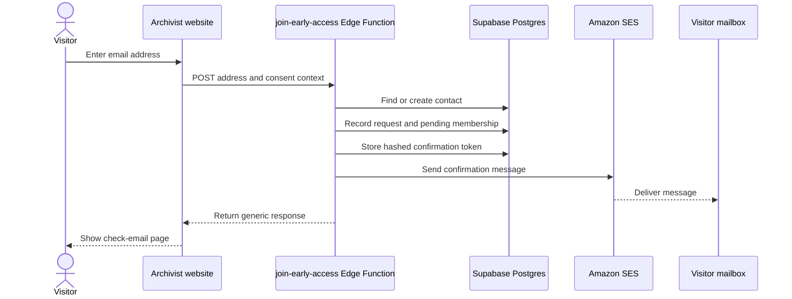
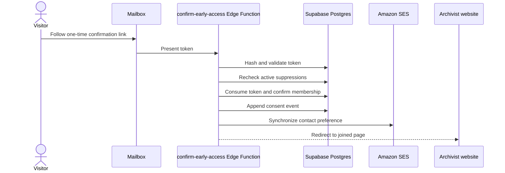
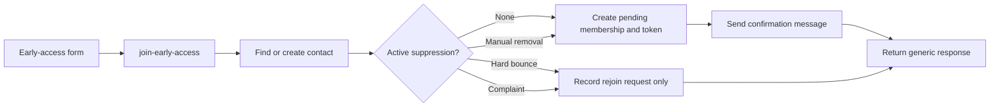
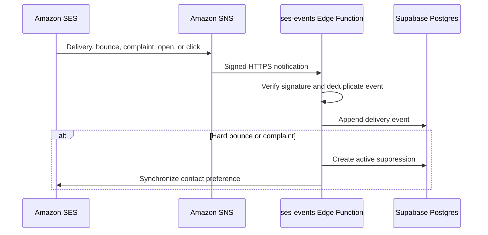

# Architecture

## Archivist early-access email

**Decision:** Write Archivist early-access messages as source-controlled HTML and
use Amazon SES for delivery. Accepted 2026-07-16; scope clarified 2026-07-16.

### Context

Archivist is collecting addresses from people who want to try the product before
its general release. This system belongs to Archivist; no company-wide
over|yonder newsletter is currently planned. We prefer to write and review its
email as source-controlled HTML rather than compose it in an email CMS. We don't
need a hosted publication, visual editor, creator network, permanent application
server, or a service priced by contact count.

The system does need reliable delivery, double opt-in, auditable consent,
standards-compliant removal handling, bounce and complaint suppression, and
resumable message dispatch.

### Direction

Use a small serverless control plane with Amazon Simple Email Service (SES) as
the delivery and deliverability layer:

- The repository contains the canonical web article, email-safe HTML, and a
  plain-text alternative for each message.
- Archivist's early-access form and branded confirmation and removal pages are
  served from `archivist.over-yonder.tech`.
- Supabase Postgres stores pending confirmations, consent history, recipient
  state, immutable message records, and per-recipient delivery state.
- Confirmation messages and early-access updates use the same delivery ledger,
  so every SES message identifier can be traced back to its recipient.
- The database records desired and observed SES topic preferences plus their
  synchronization state. Sending requires confirmed local membership, no active
  local or SES suppression, and a synchronized `OPT_IN` preference.
- Supabase Edge Functions implement joining, confirmation, removal, and SES
  event endpoints.
- A queue-backed, idempotent sender dispatches bounded batches through SES. No
  continuously running application process is required.
- SES provides outbound delivery, DKIM signing, delivery events, and bounce and
  complaint suppression.
- SES contact-list preferences are kept synchronized with the local recipient
  record. Neither source may be bypassed when selecting recipients.
- Messages are sent separately to each recipient so they can contain
  recipient-specific links and standards-compliant unsubscribe headers.
- The send operation is initiated from a repository command, not a web UI.

### Joining early access

1. Normalize and validate the submitted address.
2. Store a pending request with a hashed, random, expiring, single-use
   confirmation token.
3. Send our own HTML and plain-text confirmation message through SES.
4. On confirmation, atomically consume the token, record the consent event, and
   set the recipient and SES topic preference to `OPT_IN`.

The consent record includes the address, request and confirmation timestamps,
the source and version of the signup form, and the applicable policy version.
Pending requests don't receive early-access messages.

Joining, confirming, leaving, claiming a delivery batch, recording an SES
event, and clearing a suppression are transactional database operations. This
keeps token consumption, recipient state, consent evidence, suppression and
queue state consistent when requests race or a worker stops partway through.



The public response is deliberately identical whether the address is new,
already joined, or suppressed. This prevents the form from revealing another
person's membership or delivery history.

### Confirmation



The confirmation message is authored here rather than in SES:

```text
archivist-site/
  emails/
    early-access/
      confirm.html
      confirm.txt
      subject.txt
```

The join function inserts the expiring confirmation URL into the compiled
HTML and plain-text templates and asks SES to deliver them. SES is the
transport, not the canonical content store.

### Suppression and rejoining

Membership, consent evidence, and delivery suppression are separate records.
A public signup may record a new request, but it must never clear an active
suppression.



Soft delivery failures are retriable and don't create permanent suppression.
Hard bounces and complaints block confirmation and sending. A complaint may be
cleared only by a separate privileged administrative operation which records
who cleared it and why; the contact must then complete a fresh double opt-in.

Suppression is checked at three independent boundaries:

1. `join-early-access` checks before issuing a token or calling SES.
2. `confirm-early-access` checks again before confirming membership.
3. The sender selects only confirmed contacts without an active local or SES
   suppression.

An SES event can arrive between any two operations, so none of these checks is
redundant.

### Delivery events



SES publishes its events to SNS, which invokes the Edge Function over HTTPS.
The function verifies the SNS signature and stores each provider event once.

### Leaving early access

- Every early-access message contains a branded removal link plus the
  `List-Unsubscribe` and `List-Unsubscribe-Post` headers required for mailbox
  one-click unsubscribe.
- The one-click endpoint accepts the RFC 8058 POST operation without requiring
  authentication or further interaction.
- A browser GET displays our own confirmation or preference page and does not
  mutate early-access state. This prevents link scanners from removing
  recipients merely by following a URL.
- Removal credentials are opaque or cryptographically signed, scoped to the
  recipient and purpose, and reveal no address in clear text.
- Leaving early access updates both the local record and SES preference.
  Suppression and removal checks are repeated at dispatch time, including on
  retries.

### Message source and dispatch

An early-access update will conventionally contain:

```text
early-access-email/
  YYYY-MM-slug/
    index.html
    email.html
    email.txt
```

A command such as `early-access-email send YYYY-MM-slug` validates the source,
records an immutable message, and queues recipient deliveries. Delivery rows
and SES message identifiers make retries idempotent and auditable.

Workers claim bounded batches with expiring leases. Each attempt has its own
stable idempotency key and structured outcome; an expired lease can be reclaimed
without losing the delivery or sending concurrently from two workers.

### Infrastructure requirements

- An SES account with production access in the selected AWS region.
- A verified sending identity and custom MAIL FROM subdomain.
- Correct DKIM, SPF, and DMARC records in Cloudflare DNS.
- SES delivery, bounce, complaint, open, click, and contact-preference events
  delivered to the control plane.
- `links.over-yonder.tech` used as the HTTPS-required SES redirect domain for
  Archivist open and click tracking.
- Secrets held in deployment secret storage, never in the repository.

### Non-goals

- A browser-based editor, CMS, or email-platform-hosted canonical archive.
- A persistent listmonk-style application server.
- A company-wide over|yonder mailing list.
- Marketing automation, lead scoring, referral networks, or advertising.
- Using Fastmail to send bulk mail. Fastmail remains the human mailbox service.

### Consequences

We retain complete control over Archivist's content, URLs, consent presentation,
and data, while delegating mail transport and reputation-sensitive suppression
to SES.
The system has no permanent compute cost and no per-contact platform charge.

We are responsible for the correctness of confirmation tokens, consent records,
queue retries, recipient selection, removal synchronization, and event
processing. These paths must be idempotent and must fail closed: uncertainty
about consent or suppression means that a message isn't sent.
