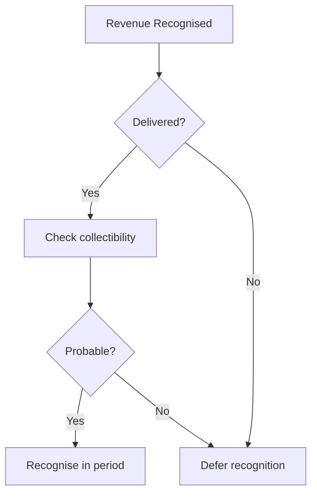
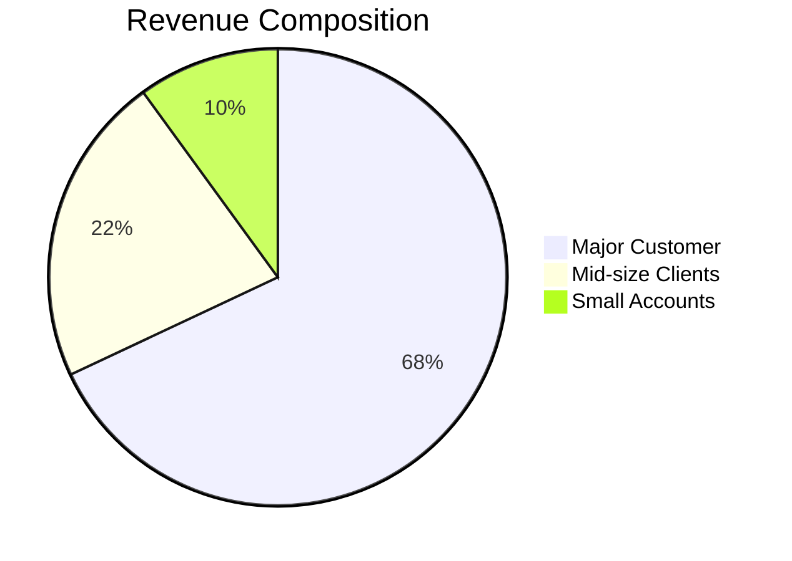

# Professional documents from plain text

<div class="author-badge">
  
  <a href="https://github.com/KaiStarkk">Kieran Hannigan</a>
</div>


A classmate sent me a case write-up last term that looked like it came out of a typesetting studio. Crisp headings, professional tables, a properly formatted equation. I assumed LaTeX -- maybe Overleaf -- so I asked. The answer was a plain text file and a tool I'd never heard of. One command, and the text file became a PDF that looked better than anything I'd produced in four years of fighting with Word.

I've since written every assignment this way. This article is the guide I wish someone had handed me at the start -- and you're reading a working example right now, because this entire page is written in the same format.

---

## Why plain text?

I should be upfront about the thing that actually pushed me over the edge, because it wasn't aesthetics. It was a group project.

Four people editing a Word document on OneDrive. Track changes enabled, supposedly. By submission night we had three conflicting versions, a paragraph that appeared twice, and a table whose formatting had quietly dissolved when someone pasted data from Excel. We spent the last two hours before the deadline not *writing* but *merging* -- comparing PDFs side by side, trying to figure out whose edits had survived.

The core problem is structural: Word stores your writing in an opaque binary format full of layout metadata, revision history, and embedded objects. The file *is* the rendered document. You can't meaningfully diff two versions. You can't merge concurrent edits with any confidence. Copy-paste from another source drags invisible formatting along for the ride, and the result is a document that looks fine on your machine and subtly wrong on everyone else's.

Plain text inverts all of this. The source file is human-readable in any editor, on any operating system, forever. Formatting is expressed as simple, visible marks *in* the text -- so there's nothing hidden to break. And because they're just text files, they play beautifully with version control. Git can show you exactly what changed between two drafts, merge concurrent edits automatically, and roll back to any previous version. That matters more than you'd think when you're co-authoring at 2AM and someone overwrites your conclusion.

---

## A brief history of typesetting in plain text

### TeX and LaTeX: the academic standard

The idea of writing documents in code is older than most people realise. In 1978, Donald Knuth -- a computer scientist who cared deeply about typography, which is either admirable or slightly unhinged depending on your perspective -- created **TeX** (pronounced "tech") because he was unhappy with how his textbooks were being typeset. His student Leslie Lamport extended it into **LaTeX** in 1984, adding higher-level commands for common structures like sections, tables of contents, and bibliographies. By the 1990s it had become the standard for academic publishing across mathematics, physics, computer science, and engineering. Career academics write *every* paper in it. The typographic output -- especially for equations -- is genuinely unmatched.

But the syntax is... confronting. Here's what a simple case analysis header looks like in LaTeX:

```latex
\documentclass[12pt]{article}
\usepackage[utf8]{inputenc}
\usepackage[margin=1in]{geometry}
\usepackage{booktabs}

\title{Systems Reliability, Inc.\ --- Case Analysis}
\author{Your Name}
\date{February 2026}

\begin{document}
\maketitle

\section{Executive Summary}
Systems Reliability is a high-volume, low-margin IT staffing firm
with \textbf{critically weak profitability} (1.4\% profit margin
vs.\ 4.6\% industry) offset by \textbf{exceptional asset efficiency}
(10.66$\times$ vs.\ 2.66$\times$ turnover).

\end{document}
```


And here's a financial comparison table:

```latex
\begin{table}[h]
\centering
\caption{DuPont Decomposition}
\begin{tabular}{@{}lrrr@{}}
\toprule
\textbf{Metric} & \textbf{SR 2019} & \textbf{Industry} & \textbf{Variance} \\
\midrule
Return on Assets   & 14.57\% & 12.17\% & +2.4 pp  \\
= Profit Margin    &  1.37\% &  4.57\% & $-$3.2 pp \\
$\times$ Asset Turnover & 10.66$\times$ & 2.66$\times$ & +8.0$\times$ \\
\bottomrule
\end{tabular}
\end{table}
```


It works. The output is genuinely beautiful. But look at the cost: `\begin` and `\end` blocks, backslash-escaped special characters, package imports just to get sensible margins. You need to *compile* the document -- often multiple passes -- to see your output. The error messages are legendary in their unhelpfulness. I once spent twenty minutes debugging a missing `}` that LaTeX had decided to report as a problem on a completely different page.

For academics who write papers every week, the investment pays off. For the rest of us -- people who need a professional-looking case analysis by Thursday -- there's something better.

---

## Markdown: plain text for the rest of us

In 2004, a writer named John Gruber created **Markdown** -- a minimal set of formatting conventions designed to be readable as-is, even before anything renders it. The idea is disarmingly simple: if you've ever written an email with `*asterisks*` for emphasis or used dashes for bullet points, you already know most of the syntax.

It stayed niche for years, quietly popular with software developers who used it for documentation. Then around 2012 something shifted. GitHub adopted **GitHub Flavoured Markdown** (GFM) as its standard, adding tables and task lists. Note-taking apps like Obsidian and Notion built their entire experience around it. Suddenly the format that programmers had been using to write READMEs was showing up in corporate wikis, academic papers, and -- eventually -- an MBA student's case submissions. It runs on every platform with a keyboard: desktop, laptop, phone, browser, even a terminal over SSH. The file is just text, so there's nothing to install and nothing to break.

Here's that same case analysis header in Markdown:

```markdown
# Systems Reliability, Inc. -- Case Analysis

**Your Name** | February 2026

## Executive Summary

Systems Reliability is a high-volume, low-margin IT staffing firm
with **critically weak profitability** (1.4% profit margin vs. 4.6%
industry) offset by **exceptional asset efficiency** (10.66x vs.
2.66x turnover).
```

You can read that without rendering it. You'd know exactly what the document says if someone emailed it to you as plain text. That's the entire point.

And the table:

```markdown
| Metric | SR 2019 | Industry | Variance |
|--------|---------|----------|----------|
| Return on Assets | 14.57% | 12.17% | +2.4 pp |
| = Profit Margin | 1.37% | 4.57% | -3.2 pp |
| x Asset Turnover | 10.66x | 2.66x | +8.0x |
```

Renders as:

| Metric | SR 2019 | Industry | Variance |
|--------|---------|----------|----------|
| Return on Assets | 14.57% | 12.17% | +2.4 pp |
| = Profit Margin | 1.37% | 4.57% | -3.2 pp |
| x Asset Turnover | 10.66x | 2.66x | +8.0x |

Same information. A fraction of the syntax. Readable in its raw form. No compilation step -- just write and preview.

---

## From plain text to finished document

Before we get into syntax, here's the part that actually matters. One command turns a Markdown file into a professional PDF:

```bash
pandoc report.md -o report.pdf --pdf-engine=xelatex
```

That's it. [Pandoc](https://pandoc.org/) reads your Markdown, quietly feeds it through LaTeX under the hood, and produces a typeset PDF with proper fonts, page numbers, and layout. You get all of LaTeX's typographic quality without ever having to look at a `\begin{document}`.

A few flags give you tighter control:

```bash
pandoc report.md -o report.pdf \
  --pdf-engine=xelatex \
  -V geometry:margin=1in \
  -V fontsize=11pt \
  --toc
```

| Flag | What it does |
|:-----|:-------------|
| `--pdf-engine=xelatex` | Uses XeLaTeX for Unicode and modern font support |
| `-V geometry:margin=1in` | Sets 1-inch margins on all sides |
| `-V fontsize=11pt` | Sets the body text size |
| `--toc` | Generates a table of contents from your headings |

Need Word instead? Change the extension. Pandoc figures out the rest.

```bash
pandoc report.md -o report.docx
```

Everything below teaches you the Markdown syntax that goes *into* that file. Pandoc handles getting it out.

---

## The essentials

This is the core syntax. Everything here works in virtually every tool that reads Markdown -- no plugins, no extensions, no special configuration.

### Headings

Use `#` symbols to create headings. More `#` signs mean deeper nesting.

```markdown
# Main Title
## Section
### Subsection
#### Sub-subsection
```

*The heading levels on this page demonstrate the hierarchy -- "Professional documents from plain text" is H1, "The essentials" is H2, and "Headings" is H3.*

### Emphasis

```markdown
This text is **bold** and this is *italic*.
You can combine them for ***bold italic***.
Use ~~strikethrough~~ to cross things out.
```

Renders as:

This text is **bold** and this is *italic*. You can combine them for ***bold italic***. Use ~~strikethrough~~ to cross things out.

### Lists

Unordered lists use `-`, `*`, or `+`. Ordered lists use numbers. Nest by indenting with two or four spaces.

```markdown
- Revenue recognition issues
  - Premature recognition
  - Channel stuffing
- Expense timing concerns
  - Capitalisation vs. expensing
  - Depreciation method choice

1. Calculate ROA
2. Decompose using DuPont framework
3. Compare to industry benchmarks
```

Renders as:

- Revenue recognition issues
  - Premature recognition
  - Channel stuffing
- Expense timing concerns
  - Capitalisation vs. expensing
  - Depreciation method choice

1. Calculate ROA
2. Decompose using DuPont framework
3. Compare to industry benchmarks

### Links and images

```markdown
See [ASC 606](https://asc.fasb.org/606) for revenue recognition guidance.


```

Renders as:

See [ASC 606](https://asc.fasb.org/606) for revenue recognition guidance.

### Blockquotes

Use `>` to quote sources or highlight key passages.

```markdown
> "The 1.37% profit margin is dangerously thin for a staffing
> business. The gap between target (10%) and actual (1.4%)
> indicates the low-cost strategy is being executed too
> aggressively, sacrificing profitability for volume."
```

Renders as:

> "The 1.37% profit margin is dangerously thin for a staffing
> business. The gap between target (10%) and actual (1.4%)
> indicates the low-cost strategy is being executed too
> aggressively, sacrificing profitability for volume."

### Code blocks

Wrap code or raw data in triple backticks. Add a language name for syntax highlighting.

````markdown
```python
roa = net_income / total_assets
profit_margin = net_income / revenue
asset_turnover = revenue / total_assets
assert abs(roa - profit_margin * asset_turnover) < 0.001
```
````

Renders as:

```python
roa = net_income / total_assets
profit_margin = net_income / revenue
asset_turnover = revenue / total_assets
assert abs(roa - profit_margin * asset_turnover) < 0.001
```

### Tables

Pipes and dashes. Colons control alignment (`:---` left, `:---:` centre, `---:` right).

```markdown
| Metric          | SR 2019 | Industry | Assessment |
|:----------------|--------:|---------:|:----------:|
| Current Ratio   |    0.57 |     1.72 |  Critical  |
| Debt / Assets   |  78.64% |   61.33% |  Elevated  |
| Interest Cover  |   3.97x |    5.73x |  Adequate  |
```

Renders as:

| Metric          | SR 2019 | Industry | Assessment |
|:----------------|--------:|---------:|:----------:|
| Current Ratio   |    0.57 |     1.72 |  Critical  |
| Debt / Assets   |  78.64% |   61.33% |  Elevated  |
| Interest Cover  |   3.97x |    5.73x |  Adequate  |

### Horizontal rules

Three dashes, asterisks, or underscores on their own line create a divider:

```markdown
---
```

*The horizontal rules between sections on this page are all produced by `---`.*

---

## Where to write

One of the quietly radical things about plain text is that you're never locked in. I've drifted between four different editors over the past year, and every time I switched, my entire library of notes came with me unchanged. No export wizard, no fidelity loss, no "Save As." Just files.

I started in [Obsidian](https://obsidian.md/) -- a desktop and mobile app that stores everything as local Markdown files in a folder it calls a "vault." The linking between notes and the graph view are genuinely useful for building a knowledge base that outlasts any single course. Group project wikis ended up in [Notion](https://www.notion.so/), which supports Markdown shortcuts but stores your content in its own cloud database -- convenient for collaboration, less convenient if you ever want to leave. My personal notes have since migrated to [SilverBullet](https://silverbullet.md/), a self-hosted platform that runs in the browser and keeps everything as Markdown files on my own server. On my phone I use [Markor](https://gsantner.net/project/markor.html) for reviewing notes on the train. And if your programme requires LaTeX -- common in quant finance or economics PhDs -- [Overleaf](https://www.overleaf.com/) is the path of least resistance: browser-based, real-time collaboration, no install.

The point is not which tool is best. The point is that it doesn't matter, because the files are the same everywhere.

---

## Power user features

The essentials above will carry you through most case write-ups. But Markdown is extensible, and there's a surprisingly rich ecosystem of add-ons for the remaining 10% -- the things you'd normally associate with LaTeX or dedicated publishing tools. Not every tool supports every extension, so I'll note compatibility where it matters.

### YAML frontmatter

Most Markdown tools support a metadata block at the top of your file, written in YAML (a simple key-value format). This controls how the document is rendered or exported -- title, author, date, export settings, and more.

```yaml
---
title: "Systems Reliability, Inc. -- Case Analysis"
author: "Your Name"
date: 2026-02-05
course: FRSA
tags: [financial-analysis, dupont, liquidity]
---
```

*Frontmatter is stripped during rendering -- it controls metadata like the title, author, and date shown at the top of this article, but doesn't appear in the body text.*

Frontmatter is ignored during rendering (it doesn't appear in your document body) but is used by tools like Pandoc, Obsidian, and static site generators to populate title pages, generate indexes, and organise content. Think of it as structured metadata for your document.

### GitHub Flavoured Markdown (GFM)

GFM is a widely adopted superset of standard Markdown, originally created by GitHub. Most modern tools support its additions:

**Task lists** -- checkboxes for tracking progress:

```markdown
- [x] Read: Financial Statement Analysis notes (RCJMS Ch 6)
- [x] Prepare: Systems Reliability CASE
- [ ] Read: Revenue Recognition notes (RCJMS Ch 3)
- [ ] Prepare: Revenue Recognition Vignettes CASE
```

Renders as:

- [x] Read: Financial Statement Analysis notes (RCJMS Ch 6)
- [x] Prepare: Systems Reliability CASE
- [ ] Read: Revenue Recognition notes (RCJMS Ch 3)
- [ ] Prepare: Revenue Recognition Vignettes CASE

**Strikethrough** with `~~double tildes~~`, **tables** (as shown earlier), and **autolinked URLs** (plain URLs become clickable without explicit link syntax) are all GFM additions that have become effectively universal.

### Mathematics with KaTeX and MathJax

For quantitative courses, you'll often need proper mathematical notation. Two JavaScript libraries render LaTeX-style maths inside Markdown documents:

- **[KaTeX](https://katex.org/)** -- Fast, lightweight, renders at page load. Preferred for most uses.
- **[MathJax](https://www.mathjax.org/)** -- Broader LaTeX coverage, slightly heavier. Better if you need obscure symbols or environments.

Both use the same syntax: `$...$` for inline maths, `$$...$$` for display (centred, block-level) equations.

```markdown
The required price increase $p$ satisfies:

$$\frac{NI + R \cdot p}{R \cdot (1 + p)} = PM_{target}$$

Solving for $p$:

$$p = \frac{PM_{target} \cdot R - NI}{R \cdot (1 - PM_{target})}$$

Substituting: $p = \frac{0.046 \times 4{,}091{,}673 - 55{,}955}{4{,}091{,}673 \times (1 - 0.046)} = 3.39\%$
```

Renders as:

The required price increase $p$ satisfies:

$$\frac{NI + R \cdot p}{R \cdot (1 + p)} = PM_{target}$$

Solving for $p$:

$$p = \frac{PM_{target} \cdot R - NI}{R \cdot (1 - PM_{target})}$$

Substituting: $p = \frac{0.046 \times 4{,}091{,}673 - 55{,}955}{4{,}091{,}673 \times (1 - 0.046)} = 3.39\%$

*Supported by: Obsidian (built-in KaTeX), Notion (built-in KaTeX), SilverBullet (KaTeX plugin), Pandoc (native LaTeX maths), and most static site generators with a plugin.*

### Diagrams with Mermaid

[Mermaid](https://mermaid.js.org/) lets you define diagrams in text. Flowcharts, sequence diagrams, Gantt charts and more -- all written inline in your Markdown file. No image editing software required.

````markdown

````

Renders as:


Mermaid also supports other diagram types that are useful for case analysis:

````markdown

````

Renders as:


*Supported by: Obsidian (built-in), Notion (built-in), GitHub (built-in), SilverBullet (plugin), and Pandoc (via mermaid-filter).*

### Footnotes and endnotes

Footnotes let you add references and asides without cluttering the main text. The syntax is simple: a marker in the text and a definition anywhere in the file.

```markdown
The firm faces severe liquidity risk[^1] and excessive leverage[^2],
which together create a fragile financial structure.

[^1]: Current ratio of 0.57 vs. industry average of 1.72. A ratio
    below 1.0 indicates current liabilities exceed current assets.

[^2]: Debt-to-assets of 78.64% vs. industry average of 61.33%.
    Interest coverage of 3.97x provides limited buffer.
```

Renders as:

The firm faces severe liquidity risk[^1] and excessive leverage[^2],
which together create a fragile financial structure.

[^1]: Current ratio of 0.57 vs. industry average of 1.72. A ratio
    below 1.0 indicates current liabilities exceed current assets.

[^2]: Debt-to-assets of 78.64% vs. industry average of 61.33%.
    Interest coverage of 3.97x provides limited buffer.

The footnote definitions don't need to be near the markers -- they can be collected at the bottom of your file. The renderer numbers them automatically and creates clickable links between the marker and the note.

*Supported by: Obsidian (built-in), Pandoc (built-in), GitHub (built-in), SilverBullet (built-in). Notion uses a different inline comment system.*

### Bibliographies and citations

For formal academic work, Pandoc supports full bibliography management using `.bib` files (the same BibTeX format used by LaTeX). You cite sources with `[@key]` syntax and Pandoc generates a formatted reference list automatically.

```markdown
---
bibliography: references.bib
csl: apa.csl
---

The DuPont framework decomposes ROE into three drivers
[@revsine2021, pp. 241-245], providing a structured approach
to identifying whether profitability, efficiency, or leverage
is responsible for performance differences.

According to @palepu2019 [ch. 9], firms with current ratios
below 1.0 face heightened refinancing risk, particularly in
cyclical industries.
```

And the corresponding `references.bib` file:

```bibtex
@book{revsine2021,
  author    = {Revsine, Lawrence and Collins, Daniel W. and
               Johnson, W. Bruce and Mittelstaedt, H. Fred
               and Soffer, Leonard C.},
  title     = {Financial Reporting and Analysis},
  edition   = {8},
  publisher = {McGraw-Hill},
  year      = {2021}
}

@book{palepu2019,
  author    = {Palepu, Krishna G. and Healy, Paul M. and
               Peek, Erik},
  title     = {Business Analysis and Valuation},
  edition   = {6},
  publisher = {Cengage},
  year      = {2019}
}
```

In Pandoc output, `[@revsine2021, pp. 241-245]` becomes "(Revsine et al., 2021, pp. 241-245)" and a formatted reference list appears at the end of the document, styled according to whichever CSL file you choose.

Pandoc supports [thousands of citation styles](https://www.zotero.org/styles) via CSL (Citation Style Language) files -- APA, Chicago, Harvard, journal-specific formats, and more. Switch styles by changing one line in your frontmatter.

*Supported by: Pandoc (built-in, the gold standard), Obsidian (via Citations plugin + Zotero), SilverBullet (via templates). Not natively supported by Notion or GitHub rendering.*

### Table of contents

Most renderers can auto-generate a table of contents from your headings.

In **Pandoc**, add `toc: true` to your frontmatter:

```yaml
---
title: "Case Analysis"
toc: true
toc-depth: 3
---
```

In **Obsidian**, insert a dynamic table of contents with the `[[toc]]` command or a community plugin.

In most **static site generators**, TOC generation is a built-in option or a one-line plugin.

The renderer scans your headings and generates a clickable, indented table of contents that stays in sync as you edit.

The advantage over a manually typed contents list: it updates automatically as you add, remove, or reorder sections.

### Definition lists

Useful for glossaries or explaining key terms in a case:

```markdown
Current Ratio
:   Current assets divided by current liabilities. Measures
    short-term liquidity. A ratio below 1.0 indicates a firm
    cannot cover its immediate obligations from liquid assets.

DuPont Decomposition
:   A framework that breaks ROE into profit margin, asset
    turnover, and financial leverage, isolating the drivers
    of equity returns.
```

In Pandoc output, the terms appear in bold with indented definitions below -- similar to a glossary format.

*Supported by: Pandoc (built-in), PHP Markdown Extra, and several Obsidian plugins. Not part of GFM or CommonMark.*

### Admonitions and callouts

Callout blocks highlight warnings, tips, or important notes. The syntax varies by tool, but a common pattern uses a decorated blockquote:

```markdown
> [!warning] Liquidity risk
> The current ratio of 0.57 means the firm cannot cover
> current liabilities from current assets. This is the most
> pressing concern regardless of profitability metrics.

> [!note] Assumption
> The price increase model assumes bill-rate elasticity only.
> Pay rates to contractors are held constant, so the full
> increase flows through to margin.
```

In Obsidian and SilverBullet, these render as coloured boxes with icons -- yellow for warnings, blue for notes -- that visually separate important asides from the main text.

*Supported by: Obsidian (built-in), SilverBullet (built-in), GitHub (partial). Pandoc uses a different div-based syntax for custom blocks.*

### Slide presentations

You can turn a Markdown file into a slide deck. Each heading becomes a new slide. This means the same source document can produce both a written report and a presentation.

**[Marp](https://marp.app/)** and **[reveal.js](https://revealjs.com/)** are popular options. Pandoc can also output to Beamer (LaTeX slides) or reveal.js directly.

```markdown
---
marp: true
theme: default
---

# Systems Reliability
## Case Analysis

---

## Executive Summary

- High-volume, low-margin IT staffing
- **1.4% profit margin** vs. 4.6% industry
- ROE of 68% driven by leverage, not operations

---

## Key Concern: Liquidity

| Metric | SR 2019 | Industry |
|--------|---------|----------|
| Current Ratio | 0.57 | 1.72 |
```


---

## Putting it together: a complete example

Here's a condensed case write-up using the features above. This is a single Markdown file that Pandoc can convert to PDF, Word, or HTML.

````markdown
---
title: "Systems Reliability, Inc. -- Case Analysis"
author: "Your Name"
date: 2026-02-05
toc: true
bibliography: references.bib
csl: apa.csl
---

# Executive Summary

Systems Reliability is a high-volume, low-margin IT staffing firm
with **critically weak profitability** (1.4% margin vs. 4.6%
industry) offset by **exceptional asset efficiency** (10.66x
turnover) [@revsine2021, ch. 6].

## Key Performance Indicators

| Metric | SR 2019 | Industry | Variance |
|:-------|--------:|---------:|---------:|
| ROA | 14.57% | 12.17% | +2.4 pp |
| Profit Margin | 1.37% | 4.57% | -3.2 pp |
| Asset Turnover | 10.66x | 2.66x | +8.0x |

## Price Increase Analysis

A price increase of $p$ achieves target margin $PM_t$ when:

$$p = \frac{PM_t \cdot R - NI}{R(1 - PM_t)} = 3.39\%$$

> [!note]
> This assumes the pay rate to contractors is fixed, so the
> full bill-rate increase flows to margin.

## Recommendations

1. **Address liquidity immediately** -- renegotiate term loan[^1]
2. **Selective price increases** of 3--4% on new contracts
3. **Reduce customer concentration** to restore pricing power

[^1]: Current ratio of 0.57 indicates inability to meet
    short-term obligations from liquid assets.

## References
````


Convert it using the same Pandoc command [from earlier](#from-plain-text-to-finished-document):

```bash
pandoc case-analysis.md -o case-analysis.pdf \
  --pdf-engine=xelatex \
  -V geometry:margin=1in \
  -V fontsize=11pt \
  --toc
```

---

## Quick reference

| You want... | You write... |
|:------------|:-------------|
| **Bold** | `**bold**` |
| *Italic* | `*italic*` |
| Heading | `## Section title` |
| Bullet list | `- item` |
| Numbered list | `1. item` |
| Link | `[text](url)` |
| Image | `` |
| Table | pipes and dashes (see above) |
| Code block | triple backticks |
| Blockquote | `> quoted text` |
| Footnote | `text[^1]` and `[^1]: note` |
| Inline maths | `$x^2$` |
| Display maths | `$$\sum_{i=1}^{n} x_i$$` |
| Horizontal rule | `---` |
| Task list | `- [x] done` |
| Citation | `[@key]` |

---

## Getting started

You don't need to learn all of this at once. Headings, bold, lists, and tables will carry you through most case submissions. Everything else is there when you need it.

If I were starting over:

1. **Pick a tool.** [Obsidian](https://obsidian.md/) if you want a free local app with live preview. [Notion](https://www.notion.so/) if you want cloud collaboration. A plain text editor if you're feeling brave.
2. **Write your next case in Markdown.** Headings for sections, a table for the financials, bold for key findings. That's enough.
3. **Install [Pandoc](https://pandoc.org/).** When you need PDF or Word output, it handles the conversion. Your Markdown file stays clean; Pandoc does the typesetting.
4. **Add features as the work demands them.** Footnotes for your next citation-heavy case. Maths notation when a quantitative problem requires it. Mermaid when a flowchart would actually clarify something.

The whole syntax fits on an index card. The output is professional enough for any submission. And because the files are just text, they'll version-control cleanly, sync across every device you own, and still be perfectly readable in twenty years -- long after whatever version of Word we're using today has been mercifully forgotten.
